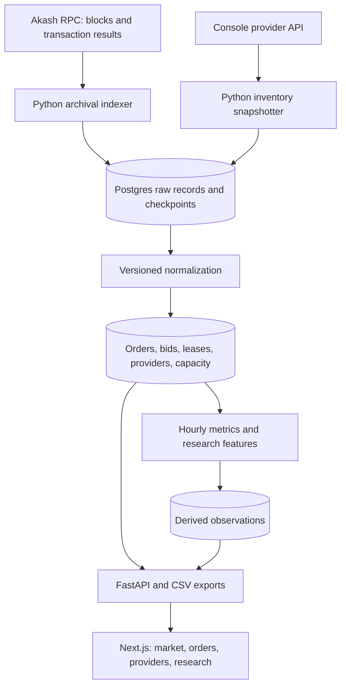

# Compute Market Research Dashboard

Akash is the initial microstructure laboratory, not a proxy for the global GPU market. This repository separates reproducible observations from derived research features and the interface used to explore them.

## Parallel ownership

| Responsibility | Data / Research | Product / Infrastructure |
| --- | --- | --- |
| Shared contract | Defines units, timing, exclusions | Owns models and migrations |
| Ingestion | RPC archive, decoding, inventory collection | Runtime configuration |
| Analytics | Definitions, calculations, validation | API and chart consumption |
| Research | Hypotheses and data quality | Filters, drilldowns, CSV |
| Operations | Restart and replay behavior | Containers and health checks |

Agree the schema and API contract before changing either side. Data contributors own `backend/src/compute_market/{ingestion,normalization,analytics,jobs}`. Product contributors own database models, migrations, API, and `apps/web`. Share fixtures so work can proceed without a live chain connection.

## Runtime boundaries

One Python package supplies separate API and job processes. PostgreSQL is the only required data service. The browser consumes the Next.js interface, which connects to FastAPI. Inventory collection is a recurring worker; bounded historical backfills are explicit CLI jobs. No production scheduler or cloud account is provisioned by this scaffold.

Raw chain archival is distinct from marketplace decoding. A successfully archived block does not mean its orders and bids have been decoded. Coverage must expose this distinction. Unsupported historical message versions require validated decoding fixtures before appearing in research tables.

Demo mode is explicit and produces synthetic API observations. It must never write demo observations into historical source tables or activate as a silent fallback after an upstream failure.

## Evolution

Start with validated source observations, order-level reconciliation, and six descriptive charts. Add wider backfills and regression datasets only after checking coverage and comparability. Later benchmark adapters should retain their own market, instrument, methodology, observation interval, and licensing metadata. Do not pool Akash bundle prices with external indices without a documented cohort mapping.
